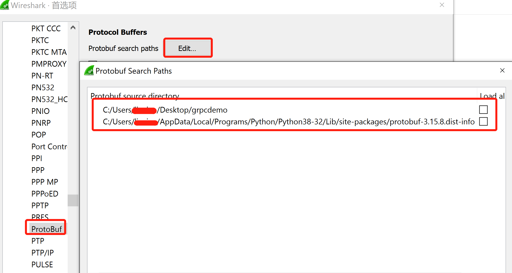

# RPC与REST

## RPC 和 REST的区别

RPC和REST是一种编程的风格，RPC风格的代码，也可以跑在HTTP上，也可以跑在其他协议上。对于RPC在HTTP上的代码，和REST的区别是这样的：

1. REST 关注HTTP Method，比如要获得一个用户的属性，那么我们一般用 GET /api/v1/user/alex 这样的方法。其中 GET表示是获得，要删除的话，则是 DELETE /api/v1/user/alex

2. RPC 不关注 HTTP Method，具体的行为是在 PATH或者Body里体现。比如 POST /api/v1/getUser/alex 或者 POST /api/v1/deleteUser/alex。不过更常见的，并不是将方法放到path里，而是在body里（保持URL的干净简洁，更容易管理，放path里不常见）。以jsonrpc为例，我们可以改为

   ```json
   POST /api
   {
     "jsonrpc": "2.0",
     "method": "getUser",
     "params": {"name": "alex"},
     "id": 1
   }
   
   POST /api
   {
     "jsonrpc": "2.0",
     "method": "deleteUser",
     "params": {"name": "alex"},
     "id": 2
   }
   ```

3. 需要注意: 有时候有些系统并为严格区分 rpc还是rest，所以会遇到混用的情况，同一个业务系统，不同的开发者，开发不同的接口，有可能风格都不一样。

4. RPC也可以跑在非http协议上，如websocket等。RPC 风格也有很多常见的类型，比如上述示例中提到的 JSON-RPC，或者 GRPC，XML-RPC, SOAP 等等。
5. 


## grpc协议网络传输层的理解

gRPC是跑在HTTP2之上的（可以是明文的HTTP，不加TLS），protobuf可以通过gRPC协议进行传输，使用WireShark抓包分析如下


## gRPC和Protobuf测试环境搭建：

* 安装gRPC的python 模块(runtime)  
``` pip install grpcio ``` 

* 安装grpcio-tools，使用这个工具，可以将.proto文件转换成python代码  
``` pip install grpcio-tools```  

* 创建一个helloworld.proto的文件，proto语法有proto2和proto3，本次示例用的是proto3  

```
// helloworld.proto
syntax = "proto3";

service Greeter {
    rpc SayHello(HelloRequest) returns (HelloReply) {}
    rpc SayHelloAgain(HelloRequest) returns (HelloReply) {}
}

message HelloRequest {
    string name = 1;
}

message HelloReply {
    string message = 1;
}
```

* 使用grpc_tools将.proto文件转换成python代码，下面的代码编译之后，会产生两个文件.  helloworld_pb2.py: 用来和 protobuf 数据进行交互, helloworld_pb2_grpc.py: 用来和 grpc 进行交互  
  ``` python -m grpc_tools.protoc --python_out=. --grpc_python_out=. -I. helloworld.proto ```

  * 也可以使用protoc命令来生成

    ```
    protoc --python_out=. message.proto
    ```

    

* 最后需要编写一个 helloworld的gRPC实现，这个分服务器端和客户端。服务端会监听在50051端口，host一个gRPC(HTTP2)服务，客户端执行的时候，会向这个端口发起gRPC请求   


a. 服务器端：hello_server.py  

``` 
from concurrent import futures
import time
import grpc
import helloworld_pb2
import helloworld_pb2_grpc

# 实现 proto 文件中定义的 GreeterServicer
class Greeter(helloworld_pb2_grpc.GreeterServicer):
    # 实现 proto 文件中定义的 rpc 调用
    def SayHello(self, request, context):
        return helloworld_pb2.HelloReply(message = 'hello {msg}'.format(msg = request.name))

    def SayHelloAgain(self, request, context):
        return helloworld_pb2.HelloReply(message='hello {msg}'.format(msg = request.name))

def serve():
    # 启动 rpc 服务
    server = grpc.server(futures.ThreadPoolExecutor(max_workers=10))
    helloworld_pb2_grpc.add_GreeterServicer_to_server(Greeter(), server)
    server.add_insecure_port('[::]:50051')
    server.start()
    try:
        while True:
            time.sleep(60*60*24) # one day in seconds
    except KeyboardInterrupt:
        server.stop(0)

if __name__ == '__main__':
    serve()
```

b.	客户端: hello_client.py  

```
import grpc
import helloworld_pb2
import helloworld_pb2_grpc

def run():
    # 连接 rpc 服务器
    channel = grpc.insecure_channel('localhost:50051')
    # 调用 rpc 服务
    stub = helloworld_pb2_grpc.GreeterStub(channel)
    response = stub.SayHello(helloworld_pb2.HelloRequest(name='czl'))
    print("Greeter client received: " + response.message)
    response = stub.SayHelloAgain(helloworld_pb2.HelloRequest(name='daydaygo'))
    print("Greeter client received: " + response.message)

if __name__ == '__main__':
    run()
```

## 使用WireShark对gRPC进行调试

* 本次只考虑gRPC明文传输，不考虑TLS加密
* 在WireShark首选项中，Protocols中找到Protobuf，然后修改 Profocol Buffers search paths，将.proto 的文件夹，以及protobuf的库文件地址添加进去


本次测试参考了下文：https://www.jianshu.com/p/43fdfeb105ff?from=timeline&isappinstalled=0

