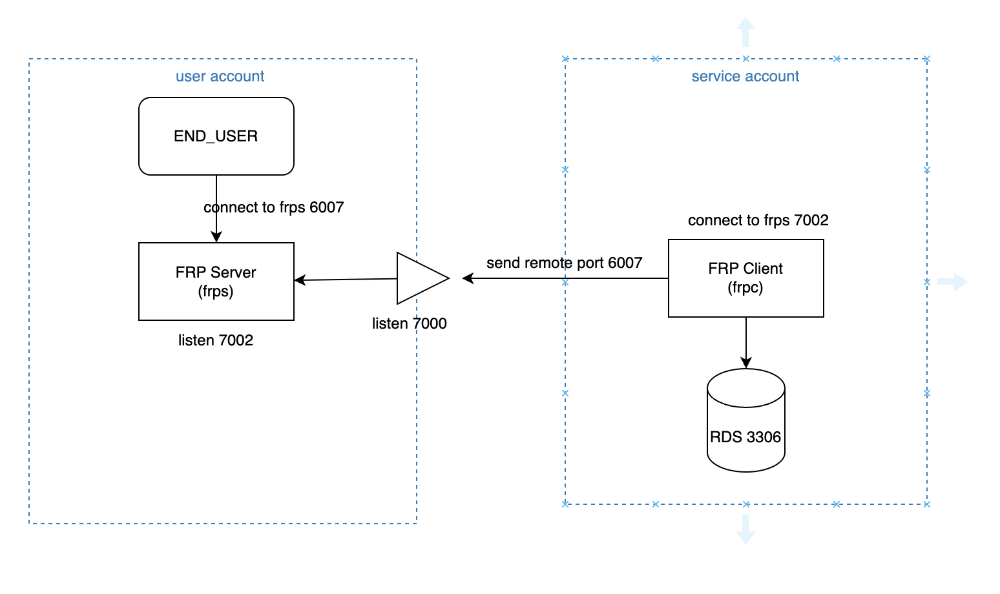

# FRP

## 简介

FRP是一个反向代理软件，文档[地址](https://gofrp.org/docs/overview/)。不仅仅支持 tcp，udp的代理，还支持 HTTP等协议。使用frp建立了一个tcp隧道之后，可以在这个隧道里，转发任意端口的流量

## 架构

如下图所示，如果想要让user account里的用户，访问 service account的数据库的3306端口，那么可以在user account里部署一个 frp server，监听到 7002端口，service account里部署 frp client，连到 frp server的7002端口，同时 service account里的 frpc 配置里，需要指明 remote_port为6007，转发的本地port是 rds的3306。这样frp server那一侧的服务，会自动监听到 frp server这台机器的6007端口。user account得用户，直接连 frp server的6007，实际流量就会转发到 service account 的 rds 3306



## 配置

frp server 的配置，只需要启动 frps 的进程，配置到 frps.ini 文件里即可

```ini
[common]
bind_port = 7002
authentication_method = token
authenticate_heartbeats = true
authenticate_new_work_conns = true
token = ANY_PLAIN_TEXT
log_file = /opt/frp/frps.log
log_level = info
log_max_days = 30
```

frp client的配置，只需要启动 frpc 的进程，配置到 frpc.ini 里即可

```ini
[common]
server_addr = FRP_SERVER_ADDRESS
server_port = 7002
authentication_method = token
authenticate_heartbeats = true
authenticate_new_work_conns = true
token = THE_FRP_SERVER_TOKEN
log_file = /opt/frp/frpc.log
log_level = info
log_max_days = 30

[db_biz_account]
type = tcp
local_ip = RDS_DNS_ADDR
local_port = 3306
remote_port = 6007
```

