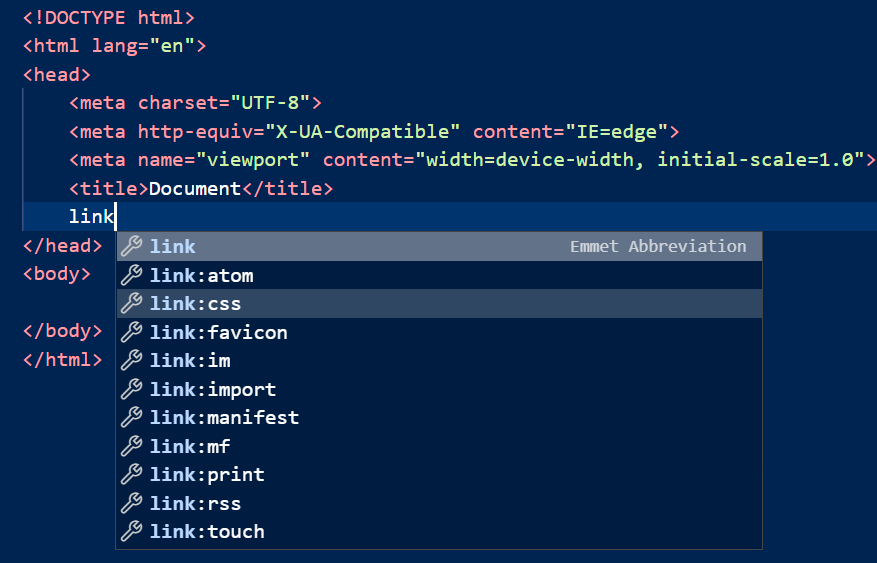

# HTML和CSS的基础

## 使用VS Code快速创建 html

打开VS Code，然后新建一个html文件，输入 ! 回车，就会自动生成html代码。然后在 head区域，输入link，会自动带出来一些选项，如下图所示，选择 link:css，则会自动补全。



同时在Body中，输入p回车，自动生成<p></p>标签，在p标签内输入任意内容。之后我们创建css文件。

在body中，输入div回车，自动生成<div></div>标签，给这个div加上一个id <div id="test"> </div>

* 在html文件中，标签中的id和class的区别是：id是唯一的，class是可复用的.

一个示例html

```html
<!DOCTYPE html>
<html lang="en">
<head>
    <meta charset="UTF-8">
    <meta http-equiv="X-UA-Compatible" content="IE=edge">
    <meta name="viewport" content="width=device-width, initial-scale=1.0">
    <title>Document</title>
    <link rel="stylesheet" href="style.css">
</head>
<body>
    <p>p label test</p>
    <div id="test">test div</div>
    <div class="c1">test div class</div>
    <p class="c1">test p class</p>
</body>
</html>
```


## 使用vs code快速创建css文件

创建一个href.css文件，然后输入 \*{}，之后在{}内可以根据vs code的提示，设置css样式。\* 表示的是全局设置。同样可以对p标签进行设置。如果要对某一个指定id的标签进行设置，如之前创建的div标签，那么就用 #id{}进行设置.

一个示例css样式

```css
* {
    background-color: blanchedalmond;
}
p {
    font-size: 30px;
}

#test {
    font-size: 50px;
}

.c1 {
    font-size: 100px;
}
```

## html嵌套css的方法

除了单独创建css文件，然后通过link引用之外，还可以将css直接写到html页面